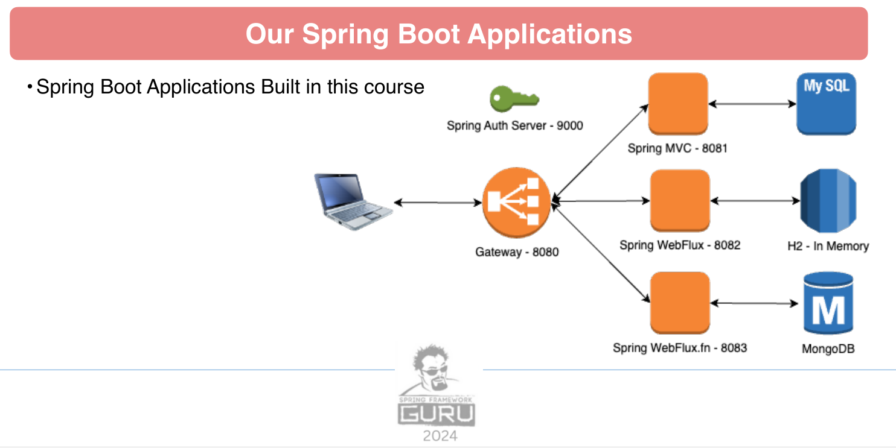

# Spring Framework 6: Beginner to Guru
## Spring 6 Rest MVC API

This is the Backend Part. Application is listening on port 8081/30081
* default profile: runs with a in memory h2 database: 
* mysql: requires mysql provided by a docker image


*Spring Framework 6 Architecture Diagram*

When Testing this module requires that the authentication server is up and running at localhost on port 9000/30090. 

- openapi api-docs: 
  - http://localhost:8081/v3/api-docs
  - http://localhost:30081/v3/api-docs
- openapi gui: 
  - http://localhost:8081/swagger-ui/index.html
  - http://localhost:30081/swagger-ui/index.html
- openapi-yaml: 
  - http://localhost:8081/v3/api-docs.yaml
  - http://localhost:30081/v3/api-docs.yaml
- h2-console: 
  - http://localhost:8081/h2-console (check application.yaml for connection parameters)
  - http://localhost:30081/h2-console (check application.yaml for connection parameters)

## Kubernetes

### Generate Config Map for mysql init script

When updating 'src/scripts/init-mysql-mysql.sql', apply the changes to the Kubernetes ConfigMap:
```bash
kubectl create configmap mysql-init-script --from-file=init.sql=src/scripts/init-mysql.sql --dry-run=client -o yaml | Out-File -Encoding utf8 k8s/mysql-init-script-configmap.yaml
```

### Deployment with Kubernetes

Deployment goes into the default namespace.

To deploy all resources:
```bash
kubectl apply -f target/k8s/
```

To remove all resources:
```bash
kubectl delete -f target/k8s/
```

Check
```bash
kubectl get deployments -o wide
kubectl get pods -o wide
```

You can use the actuator rest call to verify via port 30081

### Deployment with Helm

Be aware that we are using a different namespace here (not default).

Go to the directory where the tgz file has been created after 'mvn install'
```powershell
cd target/helm/repo
```

unpack
```powershell
$file = Get-ChildItem -Filter spring-6-rest-mvc-v*.tgz | Select-Object -First 1
tar -xvf $file.Name
```

install
```powershell
$APPLICATION_NAME = Get-ChildItem -Directory | Where-Object { $_.LastWriteTime -ge $file.LastWriteTime } | Select-Object -ExpandProperty Name
helm upgrade --install $APPLICATION_NAME ./$APPLICATION_NAME --namespace spring-6-rest-mvc --create-namespace --wait --timeout 5m --debug --render-subchart-notes
```

show logs and show event
```powershell
kubectl get pods -n spring-6-rest-mvc
```
replace $POD with pods from the command above
```powershell
kubectl logs $POD -n spring-6-rest-mvc --all-containers
```

Show Details and Event

$POD_NAME can be: spring-6-rest-mvc-mongodb, spring-6-rest-mvc
```powershell
kubectl describe pod $POD_NAME -n spring-6-rest-mvc
```

Show Endpoints
```powershell
kubectl get endpoints -n spring-6-rest-mvc
```

status
```powershell
helm status $APPLICATION_NAME --namespace spring-6-rest-mvc
```

test
```powershell
helm test $APPLICATION_NAME --namespace spring-6-rest-mvc --logs
```

uninstall
```powershell
helm uninstall $APPLICATION_NAME --namespace spring-6-rest-mvc
```

You can use the actuator rest call to verify via port 30081

## Docker

### create image
```shell
.\mvnw clean package spring-boot:build-image
```
or just run
```shell
.\mvnw clean install
```

### run image

Hint: remove the daemon flag -d to see what is happening, else it run in background

```shell
docker run --name mysql -d -e MYSQL_USER=restadmin -e MYSQL_PASSWORD=password -e MYSQL_DATABASE=restmvcdb -e MYSQL_ROOT_PASSWORD=password mysql:9
docker stop mysql
docker rm mysql
docker start mysql

docker run --name rest-mvc -d -p 8081:8080 -e SPRING_PROFILES_ACTIVE=mysql -e SPRING_SECURITY_OAUTH2_RESOURCESERVER_JWT_ISSUER_URI=http://auth-server:9000 -e SPRING_DATASOURCE_URL=jdbc:mysql://mysql:3306/restmvcdb -e SERVER_PORT=8080 --link auth-server:auth-server --link mysql:mysql spring-6-rest-mvc:0.0.1-SNAPSHOT
 
docker stop rest-mvc
docker rm rest-mvc
docker start rest-mvc
```
