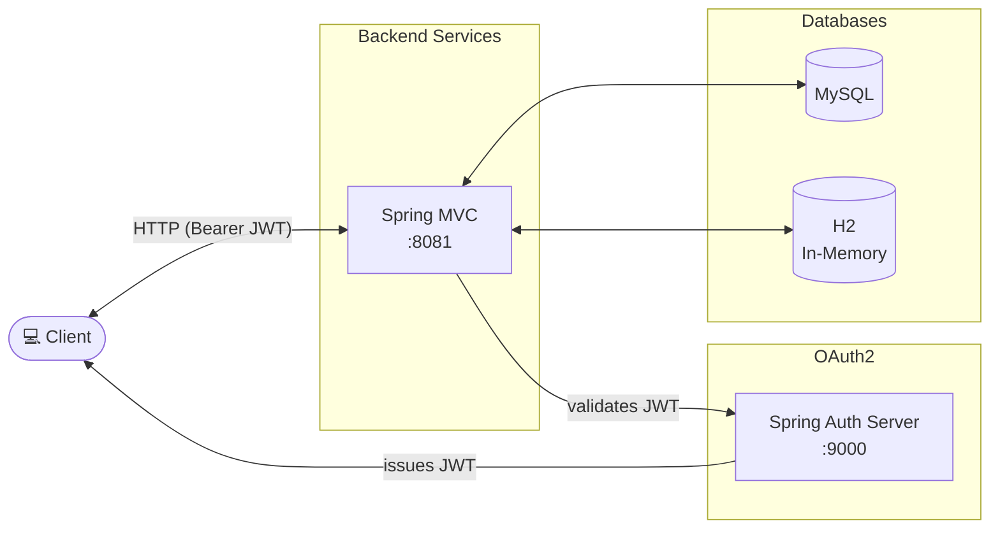
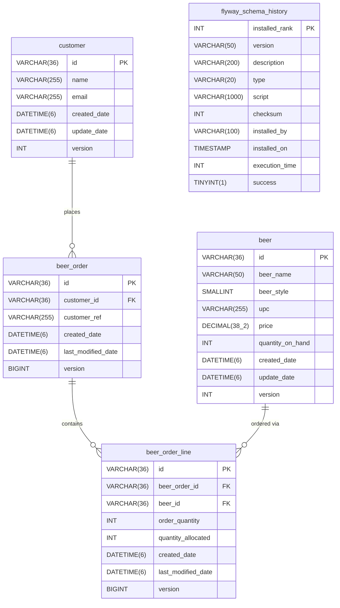

# Spring Framework 6: Beginner to Guru — Spring 6 REST MVC

Spring Boot 4 / Spring Framework 6 REST MVC backend. Exposes a Beer, Customer, and Beer-Order REST API
secured as an OAuth2 resource server.

## Architecture Overview


```mermaid
graph LR
    Client(["💻 Client"])

    subgraph Auth ["OAuth2"]
        AuthServer["Spring Auth Server\n:9000"]
    end

    subgraph Backends ["Backend Services"]
        MVC["Spring MVC\n:8081"]
    end

    subgraph Databases ["Databases"]
        MySQL[("MySQL")]
        H2[("H2\nIn-Memory")]
    end

    AuthServer -->|"issues JWT"| Client
    Client <-->|"HTTP (Bearer JWT)"| MVC
    MVC -->|"validates JWT"| AuthServer
    MVC <--> MySQL
    MVC <--> H2
```

## Database Schema


```mermaid
erDiagram
    customer {
        VARCHAR(36)  id PK
        VARCHAR(255) name
        VARCHAR(255) email
        DATETIME(6)  created_date
        DATETIME(6)  update_date
        INT          version
    }

    beer_order {
        VARCHAR(36)  id PK
        VARCHAR(36)  customer_id FK
        VARCHAR(255) customer_ref
        DATETIME(6)  created_date
        DATETIME(6)  last_modified_date
        BIGINT       version
    }

    beer_order_line {
        VARCHAR(36) id PK
        VARCHAR(36) beer_order_id FK
        VARCHAR(36) beer_id FK
        INT         order_quantity
        INT         quantity_allocated
        DATETIME(6) created_date
        DATETIME(6) last_modified_date
        BIGINT      version
    }

    beer {
        VARCHAR(36)   id PK
        VARCHAR(50)   beer_name
        SMALLINT      beer_style
        VARCHAR(255)  upc
        DECIMAL(38_2) price
        INT           quantity_on_hand
        DATETIME(6)   created_date
        DATETIME(6)   update_date
        INT           version
    }

    flyway_schema_history {
        INT           installed_rank PK
        VARCHAR(50)   version
        VARCHAR(200)  description
        VARCHAR(20)   type
        VARCHAR(1000) script
        INT           checksum
        VARCHAR(100)  installed_by
        TIMESTAMP     installed_on
        INT           execution_time
        TINYINT(1)    success
    }

    customer ||--o{ beer_order : "places"
    beer_order ||--o{ beer_order_line : "contains"
    beer ||--o{ beer_order_line : "ordered via"
```

## Prerequisites

|   Requirement   | Version  |
|-----------------|----------|
| Java            | 25       |
| Maven Wrapper   | included |
| Docker          | any      |
| Kubernetes/Helm | optional |

The **OAuth2 auth-server must be running on port 9000** (`localhost:9000`) for tests and the running
application. It is started automatically via `compose-h2.yaml` when using the default profile.

## Profiles

|  Profile  |    Database    |  Flyway  |                Notes                 |
|-----------|----------------|----------|--------------------------------------|
| `default` | H2 (in-memory) | disabled | Schema via JPA; H2 console available |
| `mysql`   | MySQL (Docker) | enabled  | Requires `compose.yaml` services     |

## Build & Test

```bash
./mvnw clean verify          # full build: format check, unit + IT tests, JaCoCo, Helm lint/template
./mvnw clean install         # verify + build local Docker image + Helm package
./mvnw test                  # unit tests only (surefire, *Test)
./mvnw verify                # integration tests only (failsafe, *IT)
./mvnw test -Dtest=BeerControllerTest              # single test class
./mvnw test -Dtest=BeerControllerTest#methodName   # single test method
./mvnw spotless:apply        # auto-fix pom/markdown/json/yaml/shell formatting
./mvnw spring-javaformat:apply                     # auto-fix Java code style
```

> Formatting is enforced at build time. Run both `spotless:apply` and `spring-javaformat:apply`
> before committing if the build fails at the `validate` phase.

## Sandbox (local dev environment)

The sandbox consists of the app (Spring Boot, port 8081) plus an auth-server (port 9000) and Kafka,
provided by `compose-h2.yaml`. The services start automatically via `spring.docker.compose.enabled=true`
when the app boots, so usually one step is enough.

### Start the sandbox (opencode-sandbox-kit)

The sandbox is provisioned by the opencode-sandbox-kit and runs as a Docker container. It mounts this
repo, starts opencode, and connects the IntelliJ MCP server.

Allow the kit source (GitHub without cloning):

```powershell
sbx settings set kit.allowedSources --% "[\"docker.io/\",\"github.com/dboeckli/\"]"
```

Start a new sandbox:

```powershell
sbx run opencode --name spring-6-rest-mvc --kit "git+https://github.com/dboeckli/opencode-sandbox-kit.git" "C:\development\projects\spring-6-rest-mvc"
```

Start the sandbox with Kubernetes support:

```powershell
sbx run opencode --name spring-6-rest-mvc --kit "git+https://github.com/dboeckli/opencode-sandbox-kit.git" "C:\development\projects\spring-6-rest-mvc" "$env:USERPROFILE\.kube:ro"
```

Apply the kit to an existing sandbox (restarts the sandbox, VM state is kept):

```powershell
sbx kit add spring-6-rest-mvc "git+https://github.com/dboeckli/opencode-sandbox-kit.git"
```

### Start the app

```shell
docker compose -f compose-h2.yaml up        # optional: start Kafka + auth-server manually (else they start with the app)
```

Then run the `SpringRestMvcApplication With H2` run configuration in IntelliJ
(`.run/SpringRestMvcApplication With H2.run.xml`, main class
`ch.dboeckli.spring.restmvc.SpringRestMvcApplication`). Alternatively start via
`./mvnw spring-boot:run`.

The compose file brings up:

- `auth-server` (port 9000) — required by the OAuth2 resource server
- `kafka` (ports 9092/29092) — required for the beer event topics

### Verify

- Swagger UI: http://localhost:8081/swagger-ui/index.html
- OpenAPI json: http://localhost:8081/v3/api-docs
- H2 console: http://localhost:8081/h2-console

## Running Locally

Start the application with `./mvnw spring-boot:run`. Spring Boot Docker Compose auto-starts
`compose-h2.yaml` (Kafka + auth-server) on startup in the default profile.

### Endpoints

|   Resource   |                    Local                    |             Kubernetes (NodePort)              |
|--------------|---------------------------------------------|------------------------------------------------|
| Application  | http://localhost:8081                       | http://\<node-ip\>:30081                       |
| OpenAPI JSON | http://localhost:8081/v3/api-docs           | http://\<node-ip\>:30081/v3/api-docs           |
| OpenAPI YAML | http://localhost:8081/v3/api-docs.yaml      | http://\<node-ip\>:30081/v3/api-docs.yaml      |
| Swagger UI   | http://localhost:8081/swagger-ui/index.html | http://\<node-ip\>:30081/swagger-ui/index.html |
| H2 Console   | http://localhost:8081/h2-console            | http://\<node-ip\>:30081/h2-console            |
| Auth Server  | http://localhost:9000                       | —                                              |

H2 connection parameters are in `src/main/resources/application.yaml`.

### IntelliJ HTTP Client

The `restRequest/` folder contains IntelliJ HTTP request files for manual API testing:

|               File                |          Coverage           |
|-----------------------------------|-----------------------------|
| `beerControllerRequest.http`      | Beer CRUD endpoints         |
| `beerOrderControllerRequest.http` | Beer order endpoints        |
| `customerControllerRequest.http`  | Customer CRUD endpoints     |
| `actuator.http`                   | Actuator/health endpoints   |
| `authServerRequests.http`         | Auth-server token requests  |
| `openapi.http`                    | OpenAPI JSON/YAML endpoints |

Environments are configured in `restRequest/http-client.env.json`:

| Environment |     App port     | Auth-Server port |              Use for              |
|-------------|------------------|------------------|-----------------------------------|
| `local`     | 8081             | 9000             | Local run via IntelliJ run config |
| `k8s`       | 30081 (NodePort) | 30900 (NodePort) | Kubernetes deployment             |

Authentication uses OAuth2 Client Credentials (`messaging-client` / `secret`, scopes `message.read message.write`).
Select the environment in IntelliJ's HTTP client toolbar before running a request.

## Docker

### Build Image

```shell
./mvnw clean install
```

Or explicitly:

```shell
./mvnw clean package spring-boot:build-image
```

### Run with Docker

Remove the `-d` flag to see logs in the foreground.

```shell
# Start MySQL
docker run --name mysql -d \
  -e MYSQL_USER=restadmin \
  -e MYSQL_PASSWORD=password \
  -e MYSQL_DATABASE=restmvcdb \
  -e MYSQL_ROOT_PASSWORD=password \
  mysql:9

# Start the application
docker run --name rest-mvc -d \
  -p 8081:8080 \
  -e SPRING_PROFILES_ACTIVE=mysql \
  -e SPRING_SECURITY_OAUTH2_RESOURCESERVER_JWT_ISSUER_URI=http://auth-server:9000 \
  -e SPRING_DATASOURCE_URL=jdbc:mysql://mysql:3306/restmvcdb \
  -e SERVER_PORT=8080 \
  --link auth-server:auth-server \
  --link mysql:mysql \
  spring-6-rest-mvc:0.0.1-SNAPSHOT

# Stop / restart
docker stop rest-mvc && docker rm rest-mvc
docker stop mysql && docker rm mysql
```

## Kubernetes

Deployment goes into the **default** namespace when using raw manifests,
or the **`spring-6-rest-mvc`** namespace when using Helm.

### Generate ConfigMap for MySQL Init Script

When updating `src/scripts/mysql-init.sql`, regenerate the Kubernetes ConfigMap:

```powershell
kubectl create configmap mysql-init-script \
  --from-file=init.sql=src/scripts/mysql-init.sql \
  --dry-run=client -o yaml | Out-File -Encoding utf8 k8s/mysql-init-script-configmap.yaml
```

### Deploy with kubectl

```bash
# Apply all resources
kubectl apply -f target/k8s/

# Verify
kubectl get deployments -o wide
kubectl get pods -o wide

# Remove all resources
kubectl delete -f target/k8s/
```

### Deploy with Helm

After `./mvnw clean install`, a packaged chart is placed in `target/helm/repo/`.

```powershell
# Navigate to the chart directory
cd target/helm/repo

# Unpack the chart archive
$file = Get-ChildItem -Filter spring-6-rest-mvc-v*.tgz | Select-Object -First 1
tar -xvf $file.Name

# Install / upgrade
$APPLICATION_NAME = Get-ChildItem -Directory |
  Where-Object { $_.LastWriteTime -ge $file.LastWriteTime } |
  Select-Object -ExpandProperty Name
helm upgrade --install $APPLICATION_NAME ./$APPLICATION_NAME \
  --namespace spring-6-rest-mvc --create-namespace \
  --wait --timeout 5m --debug --render-subchart-notes
```

### Helm Operations

```powershell
# List pods
kubectl get pods -n spring-6-rest-mvc

# Logs (replace $POD with a pod name from the command above)
kubectl logs $POD -n spring-6-rest-mvc --all-containers

# Describe a pod ($POD_NAME: spring-6-rest-mvc or spring-6-rest-mvc-mysql)
kubectl describe pod $POD_NAME -n spring-6-rest-mvc

# Show endpoints
kubectl get endpoints -n spring-6-rest-mvc

# Helm status / test / uninstall
helm status $APPLICATION_NAME --namespace spring-6-rest-mvc
helm test   $APPLICATION_NAME --namespace spring-6-rest-mvc --logs
helm uninstall $APPLICATION_NAME --namespace spring-6-rest-mvc

# Remove all resources in the namespace
kubectl delete all --all -n spring-6-rest-mvc
```

### Debugging in Kubernetes

Spawn a temporary BusyBox shell for in-cluster diagnostics:

```powershell
kubectl run busybox-test --rm -it \
  --image=busybox:1.36 \
  --namespace=spring-6-rest-mvc \
  --command -- sh
```

Use the actuator endpoint to verify the application is healthy via NodePort **30081**.
